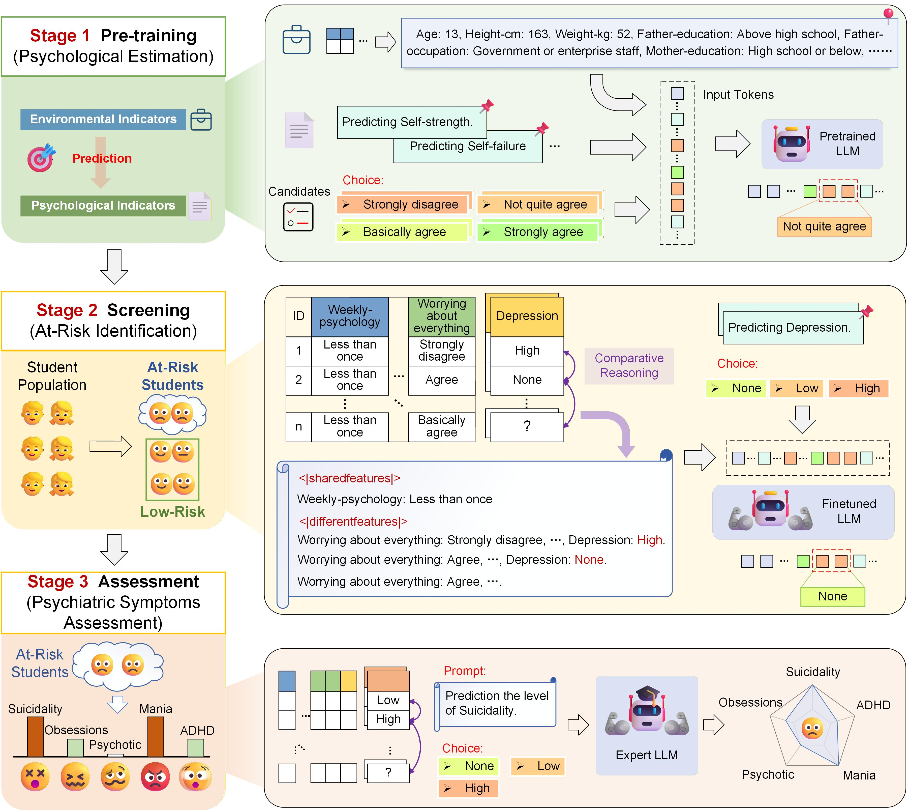

<!-- Improved compatibility of back to top link: See: https://github.com/othneildrew/Best-README-Template/pull/73 -->
<a id="readme-top"></a>
<!--
*** Thanks for checking out the Best-README-Template. If you have a suggestion
*** that would make this better, please fork the repo and create a pull request
*** or simply open an issue with the tag "enhancement".
*** Don't forget to give the project a star!
*** Thanks again! Now go create something AMAZING! :D
-->

<p align="center">
  <h2 align="center" style="margin-top: -30px;">Large-scale deep tabular language modeling for adolescent mental health assessment</h2>
</p>

 


## 📋 Overview

🌈This repository contains the official implementation implementation of our research paper “Large-scale deep tabular language modeling for adolescent mental health assessment”.

## Framework

<p align="center">
  
</p>

## 🛠️ Installation

### Setup Environment
```bash
# Create and activate conda environment
conda create -n amh python=3.8
conda activate amh

# Install dependencies
pip install -r requirements.txt
```

<p align="right"><a href="#readme-top"></a></p>

### Datasets Links


<p align="right"><a href="#readme-top"></a></p>

### Dataset Preparation

Please prepare the dataset in the following format to facilitate the use of the code:


<p align="right"><a href="#readme-top"></a></p>

### Model weights

- **LLaMA3-8B(`llama`: model backbone)** 

  The pre-trained weights of the LLaMA3-8B model will be automatically downloaded when running the training or inference scripts.  
  Alternatively, you can manually download them from Hugging Face:  
  https://huggingface.co/meta-llama/Meta-Llama-3-8B  

  After downloading, please update the `model_name_or_path` field in `configs.py` accordingly.
---
- **Proposed model (LoRA Adapter)** 

  The LoRA adapter weights of our proposed model are available at:  
  https://huggingface.co/Rango001/Adolescent-mental-health  

  Please load the adapter on top of the base LLaMA3-8B model for inference.


<p align="right"><a href="#readme-top"></a></p>

## 🚀 Training

Adjust the path and other hyperparameters in the `configs.py` files before run the code.


## 📝 Notes


## 📄 LICENSE


This project is licensed under the MIT License - see the [LICENSE](LICENSE) file for details.

<p align="right"><a href="#readme-top"></a></p>